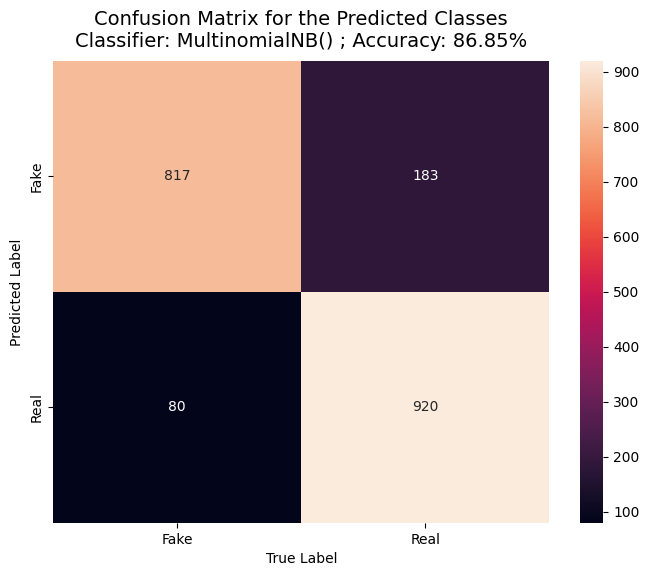
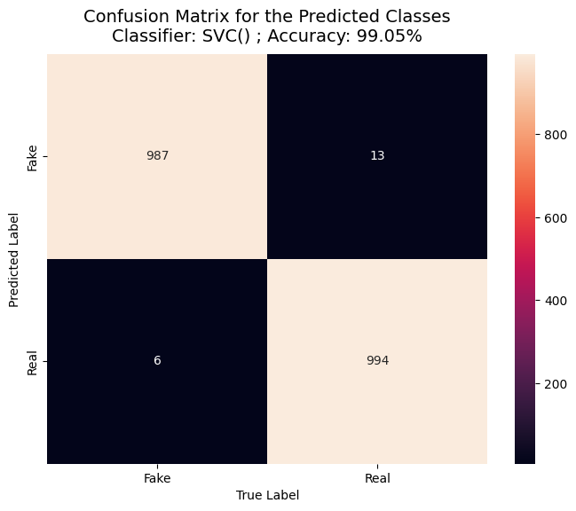

# Fake News Detection Using spaCy and scikit-learn

This project demonstrates a complete workflow for classifying news articles as Fake or Real using modern machine learning techniques. The pipeline covers data loading, preprocessing, feature extraction with spaCy, model training, evaluation, and hyperparameter tuning.

## Table of Contents
- [Fake News Detection Using spaCy and scikit-learn](#fake-news-detection-using-spacy-and-scikit-learn)
  - [Table of Contents](#table-of-contents)
  - [Project Overview](#project-overview)
  - [Dataset](#dataset)
  - [Pipeline Steps](#pipeline-steps)
    - [1. Importing Required Libraries](#1-importing-required-libraries)
    - [2. Loading and Exploring the Dataset](#2-loading-and-exploring-the-dataset)
    - [3. Feature Extraction with spaCy](#3-feature-extraction-with-spacy)
    - [4. Model Training and Evaluation](#4-model-training-and-evaluation)
    - [5. Model Selection and Hyperparameter Tuning](#5-model-selection-and-hyperparameter-tuning)
    - [6. Final Model Evaluation](#6-final-model-evaluation)
  - [Results](#results)
    - [Multinomial Naive Bayes](#multinomial-naive-bayes)
    - [Support Vector Classifier (SVC)](#support-vector-classifier-svc)
  - [How to Run](#how-to-run)
  - [Requirements](#requirements)
  - [References](#references)

## Project Overview
This repository provides a step-by-step guide to building a robust news classification model using Python, pandas, scikit-learn, and spaCy. The workflow is implemented in a Jupyter notebook and is suitable for both beginners and practitioners in NLP and machine learning.

## Dataset
The dataset consists of news articles labeled as "Fake" or "Real". It is located in the `NEWS DATA` directory:
- `news_data.csv`: Main dataset used for training and evaluation.

## Pipeline Steps

### 1. Importing Required Libraries
All necessary libraries for data manipulation, visualization, and machine learning are imported, including pandas, numpy, matplotlib, seaborn, scikit-learn, and spaCy.

### 2. Loading and Exploring the Dataset
- The dataset is loaded and the first few rows are displayed.
- Checks for missing or empty values are performed.
- The dataset is balanced by sampling an equal number of examples from each class.

### 3. Feature Extraction with spaCy
- spaCy's large English language model (`en_core_web_lg`) is used to convert news text into numerical vectors.
- These vectors are used as features for machine learning models.

### 4. Model Training and Evaluation
- The data is split into training and test sets (80-20 split, stratified by class).
- A Multinomial Naive Bayes classifier is trained and evaluated.
- Performance is measured using accuracy, confusion matrix, and classification report.

### 5. Model Selection and Hyperparameter Tuning
- GridSearchCV is used to test different classifiers (MultinomialNB, RandomForestClassifier, SVC) and hyperparameters.
- The best model and parameters are selected based on cross-validation accuracy.

### 6. Final Model Evaluation
- The best model is retrained and evaluated on the test set.
- Confusion matrices and classification reports are generated for each classifier.

## Results
Below are the confusion matrices for different classifiers (see the `RESULTS` directory for images):

### Multinomial Naive Bayes


### Support Vector Classifier (SVC)


Grid search results are also available in `RESULTS/grid_search_results.csv`.

## How to Run
1. Clone this repository.
2. Install the required packages (see below).
3. **Install the Kaggle API for dataset download:**
   ```bash
   pip install kaggle
   ```
4. **Download your `kaggle.json` API key from your Kaggle account ([instructions here](https://www.kaggle.com/docs/api#getting-started-installation-&-authentication)).**
   - Place `kaggle.json` in the directory `~/.kaggle/` (Linux/Mac) or `C:\Users\<YourUsername>\.kaggle\` (Windows).
   - Make sure the file has the correct permissions.
5. Download the `en_core_web_lg` spaCy model:
   ```bash
   python -m spacy download en_core_web_lg
   ```
6. Open the notebook `News_Classification_Notebook.ipynb` in Jupyter or VS Code.
7. Run the cells sequentially.

## Requirements
- Python 3.7+
- pandas
- numpy
- matplotlib
- seaborn
- scikit-learn
- spacy
- kaggle (for dataset download)

Install dependencies with:
```bash
pip install -r requirements.txt
```

## References
- [spaCy Documentation](https://spacy.io/)
- [scikit-learn Documentation](https://scikit-learn.org/)
- [Kaggle API Setup and Authentication](https://www.kaggle.com/docs/api#getting-started-installation-&-authentication)

---

